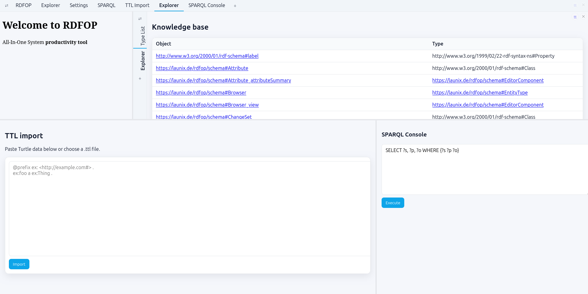

# RDFOP (aka FOP II)

RDFOP is a feature oriented programming framework based on RDF (resource description format). It is a *universal low code tool* which means you have a WYSIWIG editor and you can edit every aspect of the software. A software is purely described by data in RDF format.

## Knowledge Bases and Triple Stores

To store data of any kind, a so-called _knowledge base_ is used.
The most common format for knowledge bases is the so-called _triple store_ AKA RDF (Resource Description Format).
RDF organizes all data in so-called triplets (subject, predicate, object). A common format to express RDF data is .ttl.
Here's an example `.ttl` file:
```
peter a Person;
 forename "Peter";
 surname "Griffindor".
```
which is a short form of:
```
peter a Person.
peter forename "Peter".
peter surname "Griffindor".
```

Now you can query RDF data using SPARQL:
```
SELECT ?forename, ?surname
WHERE {
	?person a Person;
	forename ?forename;
	surname ?surname.
}
```
which will result in:
```
{ "forename": "Peter", "surname": "Griffindor" }
```

## The .rdfhp format

Now if you can query arbitrary knowledge from the knowledge base, what to do next?
We have to somehow style and display the retrieved data. This is what RDFHP is for.
RDFHP stands for RDF hypertext preprocessor and has the following syntax:

```
@PREFIX lx: <https://launix.de/rdf/#> .

PARAMETER ?page "page" // reads GET parameter "page" into ?page

SELECT ?title, ?content WHERE {?page lx:isa lx:page; lx:title ?title; lx:content ?content}

?><!doctype html><html><head>
<title><?rdf PRINT HTML ?title ?></title>
</head><body>
<?rdf PRINT RAW ?content ?>
</body></html>
```

with the following syntax rules:

- `PARAMETER ?param param` will bind ?param to the GET parameter "param"
- you need to write `PREFIX` only once per rdfhp document
- if you add `BEGIN...END` after a `SELECT`, the part between `BEGIN` and `END` is looped over the results
- if there is not `BEGIN...END` after a `SELECT`, only one result will be fetched and the selected variables will be inserted into the current scope
- `PRINT FORMAT ?variable` will print out the content of the variable. `FORMAT` is one of `RAW`, `HTML`, `JSON`, `SQL` and will especially escape strings to be invulnerable to XSS or SQL injections

## Component System

RDFOP uses a data-driven component system. Every UI element is described as RDF data — the same way your application data is stored. Components are defined as `rdfop:EditorComponent` instances in Turtle and are linked from an `rdfop:EntityType` via predicates such as `rdfop:view` and `rdfop:edit`.

### Defining a Component

A minimal component consists of:

1. An entity type (`rdfop:EntityType`)
2. One or more component bindings such as `rdfop:view` or `rdfop:edit`
3. An RDFHP template on the `rdfop:EditorComponent`

```ttl
@prefix rdfop: <https://launix.de/rdfop/schema#> .
@prefix rdf: <http://www.w3.org/1999/02/22-rdf-syntax-ns#> .
@prefix rdfs: <http://www.w3.org/2000/01/rdf-schema#> .

rdfop:Greeting a rdfop:EntityType ; rdfs:label "Greeting" .
rdfop:message a rdf:Property ; rdfs:domain rdfop:Greeting ; rdfs:range rdfs:Literal .

rdfop:Greeting_view a rdfop:EditorComponent ;
  rdfop:componentTemplate """@PREFIX rdfop: <https://launix.de/rdfop/schema#> .
PARAMETER ?id "id"
SELECT ?msg WHERE { ?id rdfop:message ?msg }
BEGIN
?><div class='rdfop-c'
       data-rdfop-params='{&quot;id&quot;:<?rdf PRINT JSON ?id ?>}'
       data-testid='<?rdf PRINT HTML ?id ?>'>
  <p><?rdf PRINT HTML ?msg ?></p>
</div><?rdf
END""" .

rdfop:Greeting rdfop:view rdfop:Greeting_view .

myGreeting a rdfop:Greeting ;
  rdfop:message "Hello from RDFOP!" .
```

The template is standard RDFHP: a SPARQL query fetches data, `BEGIN...END` loops over results, and `?>...<?rdf` switches between code and HTML output. The variable `?id` is passed as a request parameter to the component template.

### Wrapper Contract

Every swappable component should render a root element with `class='rdfop-c'` and `data-rdfop-params='...'`. The current runtime uses `data-rdfop-params` rather than the older `data-rdfop-id` / `data-rdfop-prop` pattern.

Typical wrapper:

```html
<div class='rdfop-c'
     data-rdfop-params='{&quot;id&quot;:<?rdf PRINT JSON ?id ?>}'
     data-testid='<?rdf PRINT HTML ?id ?>'>
  <!-- your content here -->
</div>
```

`data-testid` is optional for the UI itself, but useful for the embedded Playwright tests.

### View / Edit Switching

Components are usually switched with:

- `rdfopSwap(el, "view")`
- `rdfopSwap(el, "edit")`

The runtime fetches `/rdfop-render?...` and replaces the current `.rdfop-c` node with freshly rendered HTML. Saving is typically done through `rdfopCommit(...)`, which POSTs DELETE/INSERT Turtle to `/rdfop-save`.

### RDFHP Print Formats

Inside templates, use `PRINT FORMAT ?var` to output values safely:

| Format | Function | Use for |
|--------|----------|---------|
| `RAW` | No escaping | Trusted HTML content |
| `HTML` | Escapes `<>&"` | Text in HTML elements and attributes |
| `JSON` | JSON-encodes with quotes | Data attributes, JavaScript values |
| `URL` | URL-encodes | Query parameters, href attributes |

### JavaScript API

The framework provides these global functions:

| Function | Description |
|----------|-------------|
| `rdfopSwap(el, mode)` | Replace a `.rdfop-c` element with a different component mode |
| `rdfopCommit(btn)` | Save changes (DELETE old + INSERT new triple), then swap to `"view"` |
| `rdfopSave(deleteTtl, insertTtl)` | Low-level triple mutation helper used by many components |
| `rdfopRefreshCanvas()` | Re-render the main canvas while preserving active tabs |

### Server Endpoints

| Endpoint | Method | Description |
|----------|--------|-------------|
| `/rdfop-render?id=...&mode=...` | GET | Render a component and return HTML |
| `/rdfop-save` | POST | Delete and/or insert triples (`delete=TTL&insert=TTL`) |
| `/rdfop-create` | POST | Create a new child entity under a parent |
| `/rdfop-delete` | POST | Delete a subtree by id |
| `/rdfop-source-cleanup` | POST | Server-side cleanup for cross-window drag/drop moves |
| `/rdfop-playwright-tests` | GET | Expose embedded Playwright tests stored in RDF |

### Built-In Layout Components

The current UI is centered around a few self-describing layout primitives:

- `rdfop:ComponentSelector` — palette / placeholder that either shows a palette or a selected child
- `rdfop:Split` / `rdfop:SplitH` / `rdfop:SplitV` — split panes with draggable separator
- `rdfop:TabGroup` / `rdfop:Tab` — tabbed layout with reorderable tabs
- `rdfop:HTMLView`, `rdfop:Website`, `rdfop:Browser`, `rdfop:Explorer`, `rdfop:Settings`, `rdfop:SPARQLConsole`, `rdfop:TTLImport`

Drag and drop is URI-based. Internal drags use `/view/<id>` URLs; external `http/https` links can be dropped into palettes or tab bars and are materialized as `rdfop:Website` nodes.

## What You Can Build

RDFOP is designed for highly interactive, data-driven apps. With its RDF-first data model, SPARQL queries, and snippet-based SPA UI (AJAX overlays), you can create:

- CRMs: Contacts, companies, pipelines, custom fields, and reports.
- TODO list managers: Tasks, tags, filters, and Kanban views.
- UML chart designers: Diagrams persisted as triples; queryable models.
- Workflow automation tools: Rules, triggers, actions; visual editors.
- Brainstorming canvases: Notes, groups, relations; collaborative sessions.
- Collaborative image editors: Annotations and layers stored in RDF.
- Browser games: Game state and levels expressed as data, rendered via snippets.

## Build Instructions

Build the bundled `memcp` dependency:
```
git clone https://github.com/launix-de/rdfop
cd rdfop
make
```

Then run the server:
```
./run.sh
```

Then open: http://localhost:3443

On startup, RDFOP loads `components.ttl`, which in turn includes the component files under `components/`. `example.ttl` is loaded only for a fresh empty database. You can import additional TTL files via the web UI (`Settings` → `TTL Import`).

## Testing

Playwright is configured to start the app via `./run.sh`:

```bash
npm install
npm run test:playwright
```

The test cases are embedded in the RDF schema itself via `rdfop:PlaywrightTest` and exposed through `/rdfop-playwright-tests`. This makes it possible to keep component-specific regression tests next to the component definitions.

## Vim syntax for Turtle (.ttl)

This repo includes a simple Vim/Neovim syntax highlighter for Turtle files.

- Files: `vim/ftdetect/ttl.vim` and `vim/syntax/ttl.vim`
- Usage (Vim): copy both files to `~/.vim/ftdetect/` and `~/.vim/syntax/`, or add this repo’s `vim/` directory to your `runtimepath`.
- Usage (Neovim): copy to `~/.config/nvim/ftdetect/` and `~/.config/nvim/syntax/`.
- Open any `*.ttl` file to get highlighting (directives, IRIs, QNames, strings, numbers, booleans, comments, etc.).
